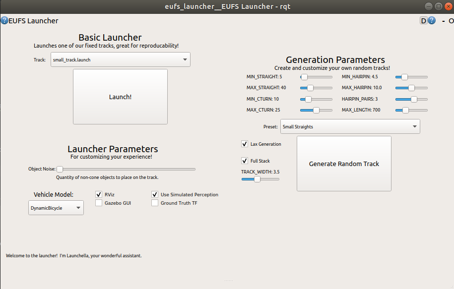

# EUFS Simulator

En el workspace llamado sim, podemos encontrar el simulador y sus dependencias.

Para compilar el simulador, primero tendremos que instalar las dependencias necesarias. Estando dentro de la carpeta sim:
```
rosdep install -i --from-path src/
```
Depues, tendremos que construir y compilar el paquete, que lo haremos con el siguiente comando:
```
catkin build
```
Con esto, el simulador debería de estar instalado correctamente.


## Ejecutar el simulador
Para ejecutar el simulador, primero tendremos que hacer source a le workspace sim. Esto se hara mediante el siguiente comando, que haciendolo una vez, en caso correcto ya no sera necesario volver a hacerlo:
```
echo "source ~/sim/devel/setup.bash" >> ~/.bashrc
```
Con esto, al abrir una nueva terminal podremos ejecutar el simulador y sus dependencias. Lo haremos de la siguiente manera:
```
roslaunch eufs_launcher eufs_launcher.launch
```

